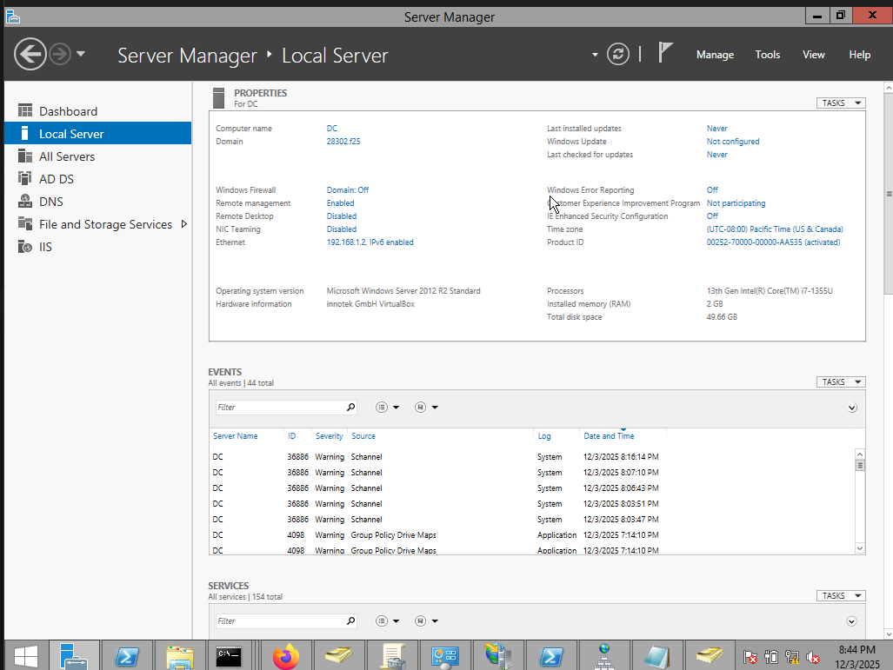
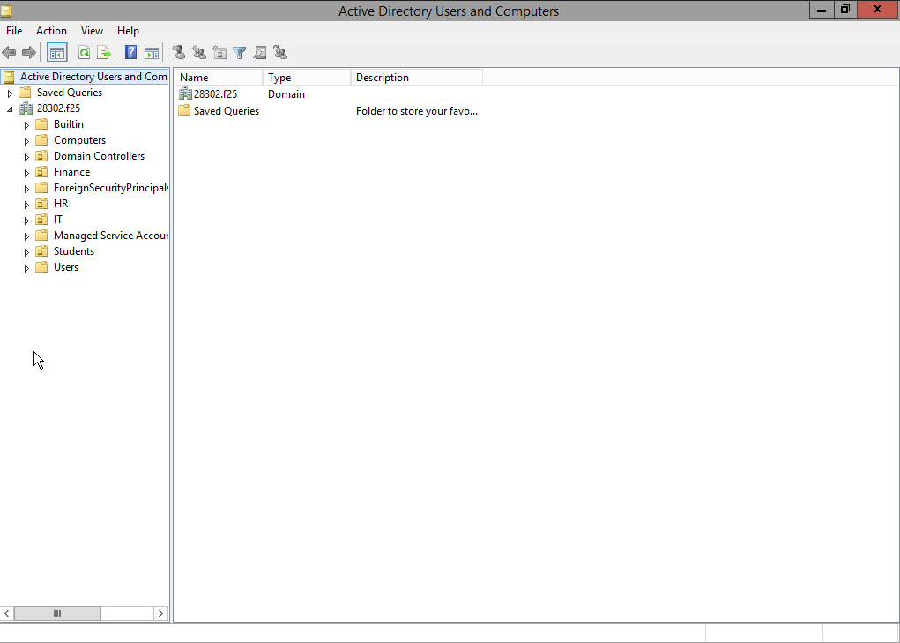
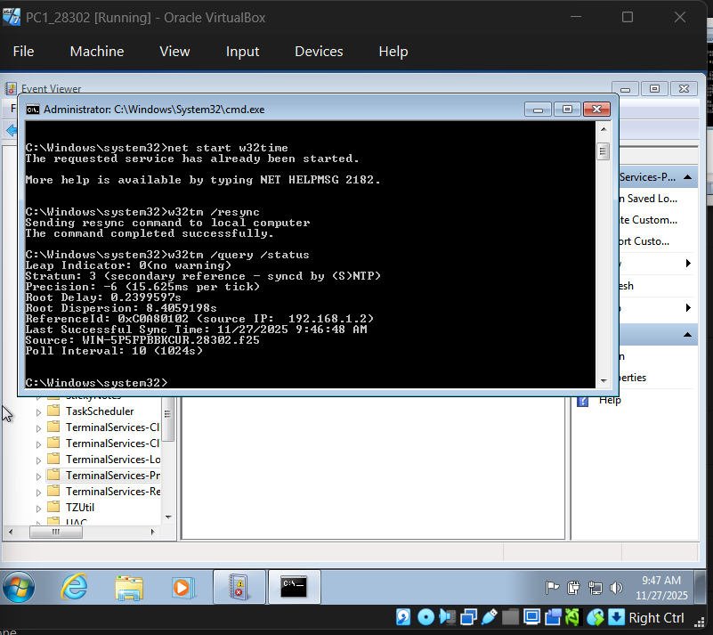
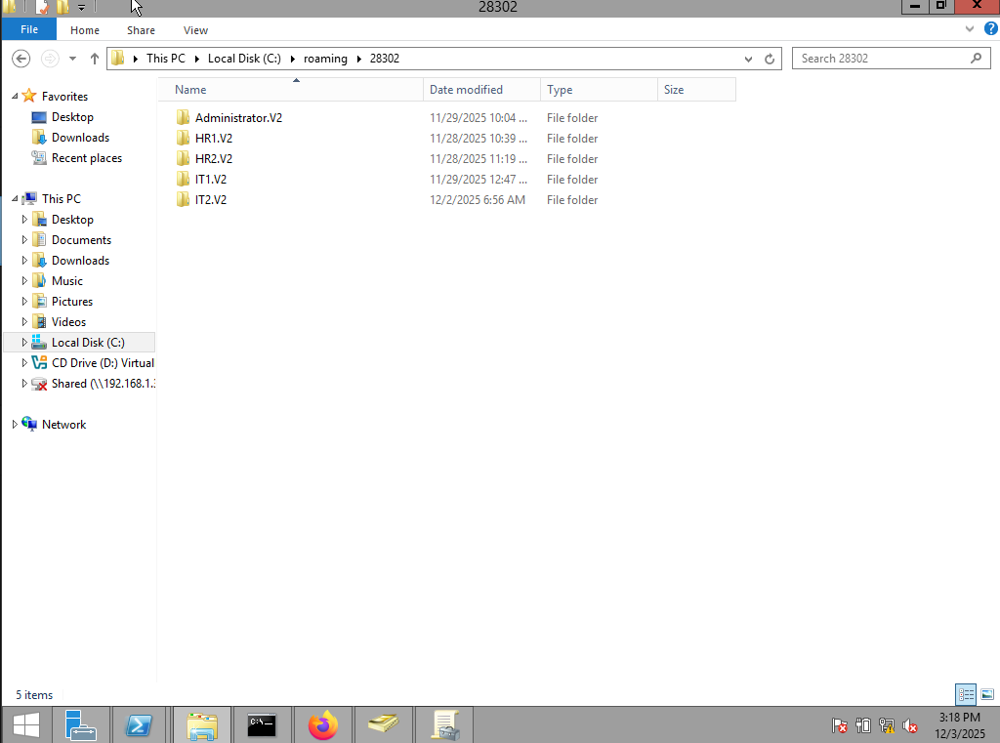
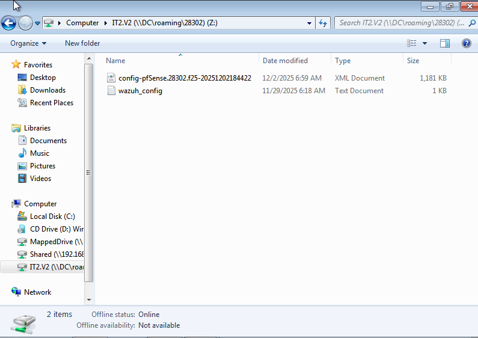
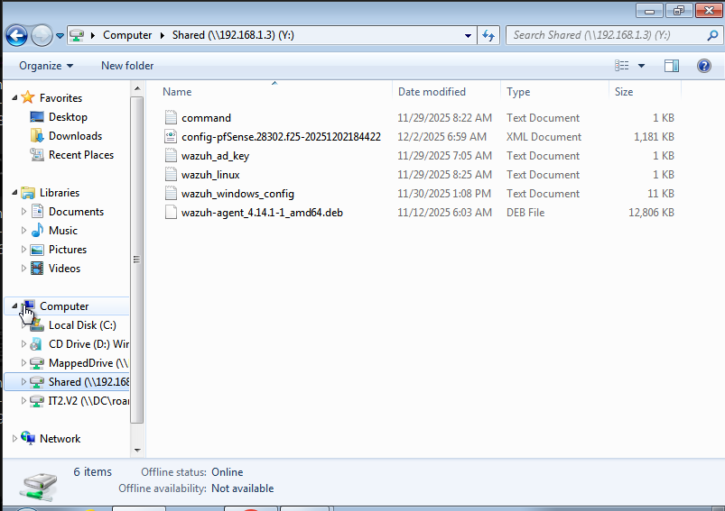
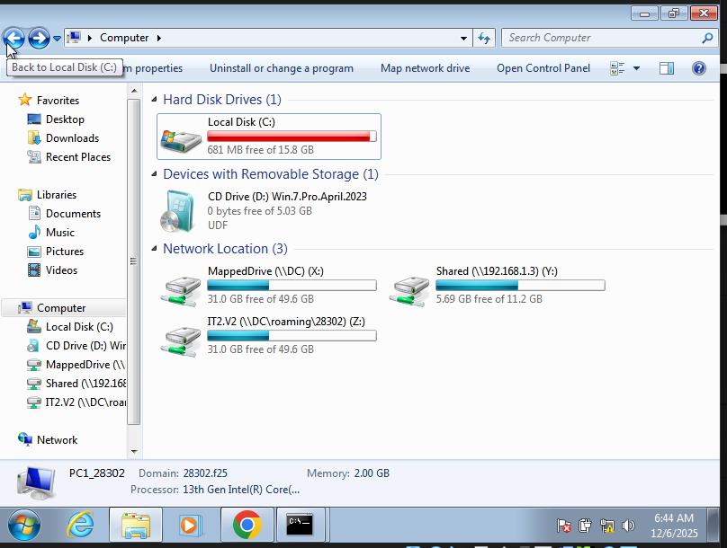

# Task 2 — Active Directory & Group Policy (Windows Server)

This section documents the setup and configuration of **Windows Server Active Directory** and Group Policies for the
Phase 2 lab.

---

## 1. Windows Server Installation & Promotion

- Installed Windows Server (2008–2022 recommended).
- Promoted to **Domain Controller** for domain: `StudentID.f25`.

**Evidence:**  

---

## 2. Organizational Units (OUs) & User Accounts

**OUs Created:**

- IT
- HR
- Students
- Finance

**Example Users:**

| OU       | Sample Users       |
|----------|--------------------|
| IT       | IT1, IT2           |
| HR       | HR1, HR2           |
| Students | Student1, Student2 |
| Finance  | Fin1, Fin2         |

**Naming Convention:** `OU + sequential number`

**Evidence:**  

---

## 3. IIS & Portfolio Website

- Installed IIS on the DC.
- Hosted a portfolio website with:
    - Full name
    - StudentID
    - Profile picture
    - Professional summary
    - Education & experience
    - Skills & certificates
    - Contact info

**Evidence:**  

---

## 4. NTP Configuration

- Configured **NTP** on the DC.
- Pushed NTP client settings via GPO to all domain systems.

**Evidence:**  

---

## 5. Roaming Profiles & Mapped Drives

- Configured **roaming profiles** and **mapped drives** via GPO.
- Example paths:

**Evidence:**  

