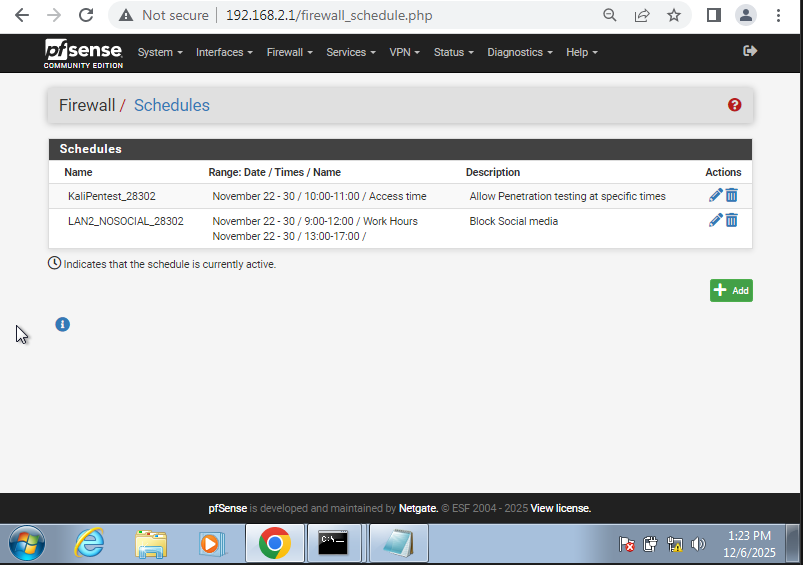
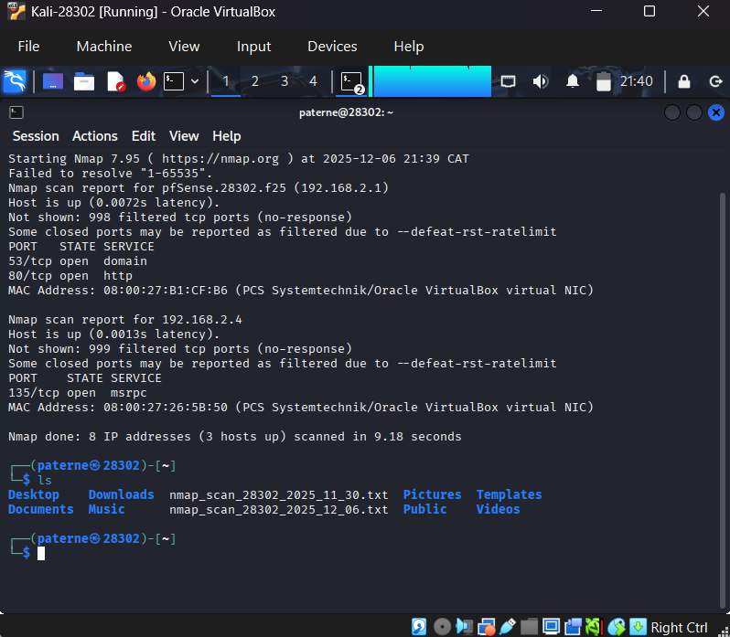

# Task 6 — Kali Pentest & Controlled Detection

Prepared by **Paterne MURENZI (StudentID: 28302)**

---

## 1. Environment Setup

**Kali Linux:** 2025.3 on Public/NAT  
**Target Network:** 192.168.2.0/29  
**pfSense Schedule:** KaliPentest_28302 (1 hour window)



---

## 2. Network Scanning

### Nmap Command

```bash
nmap -sS -Pn -T4 -p 1-65535 --open -oN nmap_scan_28302_20241206.txt 192.168.2.0/29
```

### Flag Justification

- **-sS (SYN Scan):** Half-open scan, stealthier, doesn't complete TCP handshake, less logging
- **-Pn (Skip Host Discovery):** Bypasses ICMP ping, useful when firewalls block ping, increases stealth

## Output:

[Nmap scan output](files/config-pfSense.28302.f25-20251202184422.xml)



