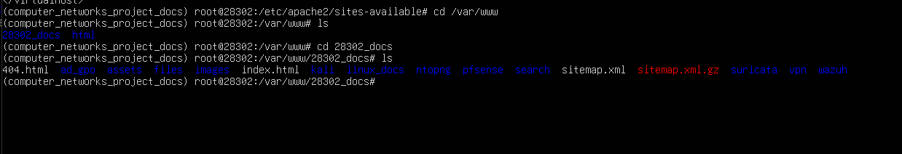
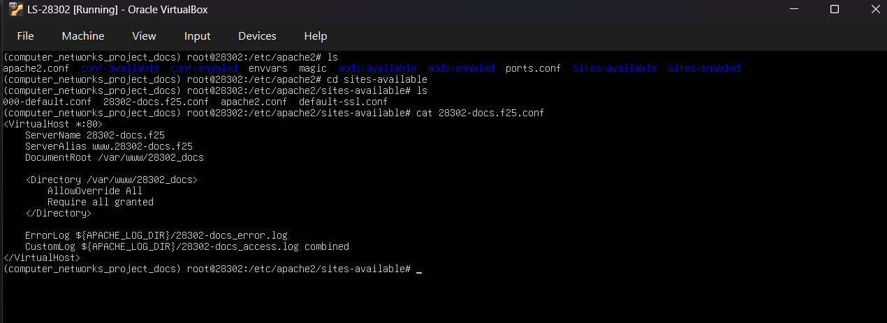
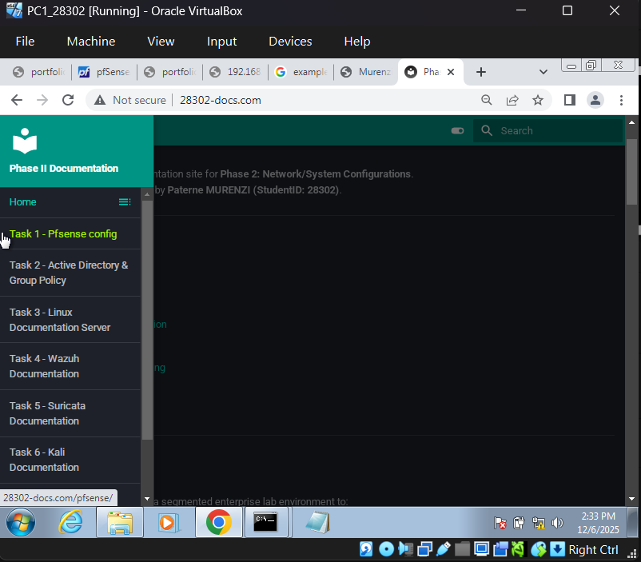
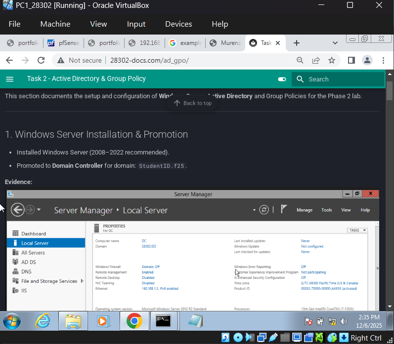

# Task 3 — Linux Documentation Server (Apache/Nginx + DHCP for LAN1)

This section documents the setup of the **Linux Documentation Server** for the Phase 2 lab environment.

---

## 1. Linux Server Installation

- Installed **Ubuntu Server** (or Red Hat) on `LS-28302`.
- Configured hostname: `LS-28302`.
- Installed necessary packages: `apache2` or `nginx`, `isc-dhcp-server`, `wget`, `curl`.

---

## 2. Documentation Website Setup

- Hosted multi-tab documentation site under `/var/www/28302_docs/`.
- Virtual host configuration:

**Evidence:**  






I edited the 
```bash
sudo nano /etc/apache2/sites-available/28302-docs.f25.conf
```