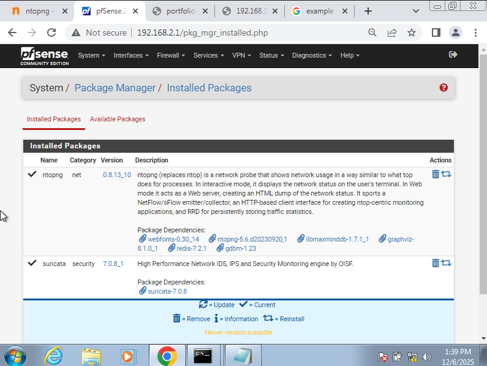

# Task 8 — Monitoring Network Traffic with NTOPng

Prepared by **Paterne MURENZI (StudentID: 28302)**

---

## 1. NTOPng Installation

### pfSense Package Installation

1. Navigate to **System → Package Manager → Available Packages**
2. Search for "ntopng"
3. Click **Install** and wait for completion
4. Access via **Diagnostics → ntopng Settings**

---

## 2. Configuration

### Interface Setup

Navigate to **Diagnostics → ntopng Settings**

**Monitored Interfaces:**

- LAN1 (192.168.1.0/24) - Management & Services
- LAN2 (192.168.2.0/29) - Lab Network
- WAN (External traffic monitoring)

**Settings:**

- DNS Mode: Decode DNS responses
- Local Networks: Auto-detect
- Data Retention: 7 days
- Enable Alerts: Yes

### Access Dashboard

URL: `http://<pfSense-IP>:3000`  
Default credentials: admin/admin (change immediately)

---

## 3. Dashboards

