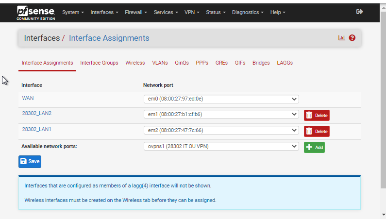
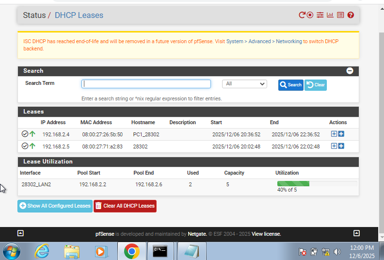
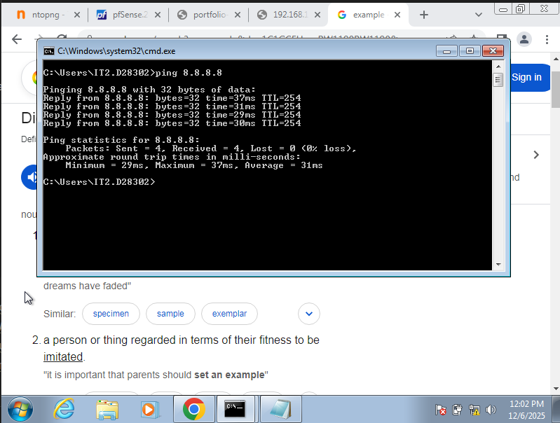
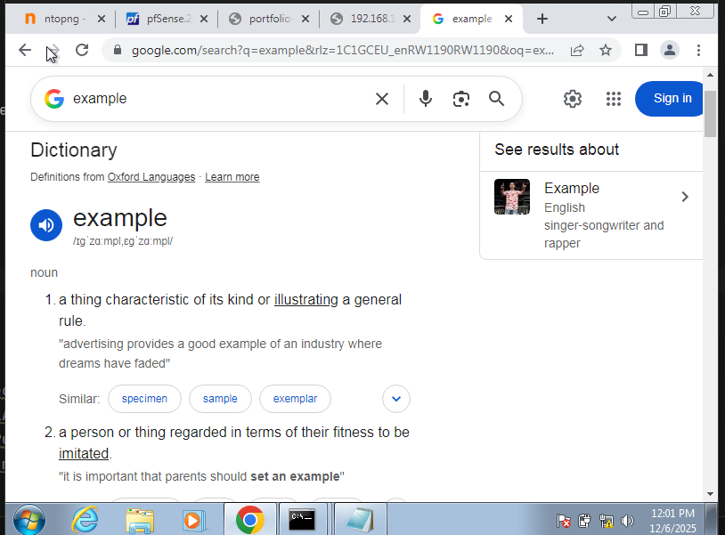
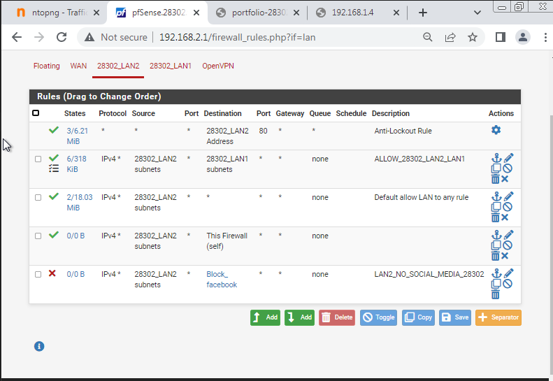
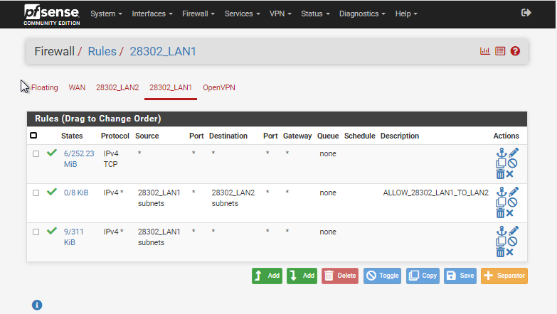
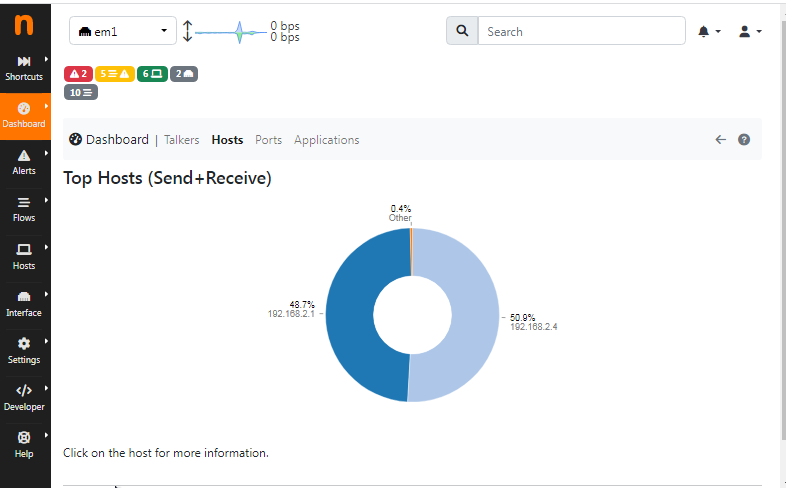
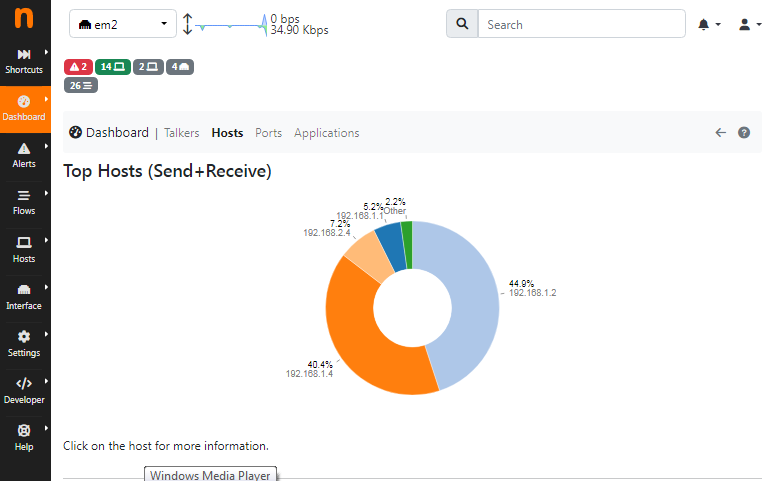
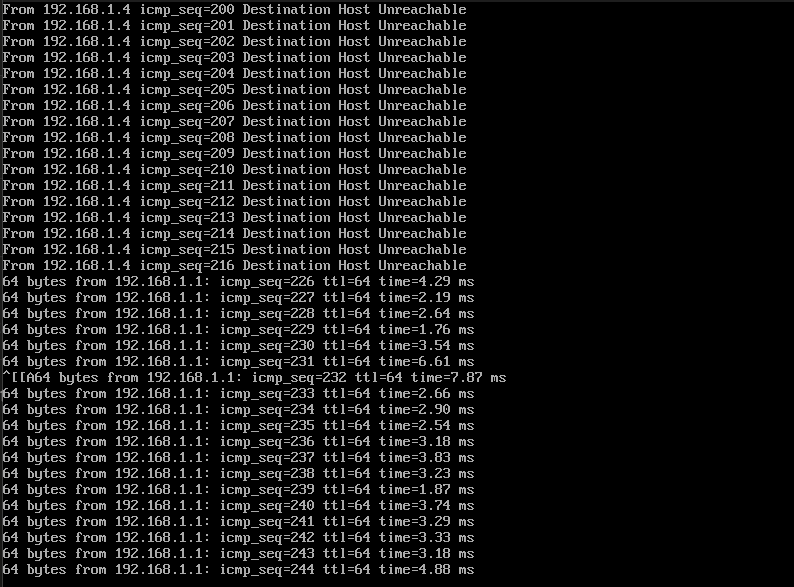

# Task 1 — pfSense (Firewall, NAT, Schedules, NTOPng, Logging & Backup)

This section documents the configuration of pfSense for the Phase 2 lab environment.

---

## 1. Interfaces Configuration

- **WAN (NAT)**: Connected to host/NAT network for Internet access.
- **OPT1 (LAN1)**: 192.168.1.1/29 — internal servers and Linux clients.
- **OPT2 (LAN2)**: 192.168.2.1/29 — Windows clients managed by pfSense DHCP.

**Evidence:**  

---

## 2. DHCP Configuration

- pfSense provides **DHCP only for LAN2**.
- Linux server provides DHCP for LAN1.

**DHCP Range for LAN2:**

**Evidence:**  

---

## 3. NAT Outbound

- Configure **automatic/manual NAT outbound** so internal hosts can access the Internet.

**Evidence:**  

---

## 4. Firewall Rules

| Rule Name                   | Purpose                                                                           |
|-----------------------------|-----------------------------------------------------------------------------------|
| ALLOW_28302_LAN1_TO_LAN2    | Allow bi-directional traffic between LAN1 and LAN2                                |
| ALLOW_28302_ALL_TO_WEBPAGES | Allow LAN1, LAN2, NAT to access hosted web pages                                  |
| KaliPentest_28302           | Allow Kali (Public/NAT) access to internal networks for 1 hour (schedule applied) |
| LAN2_NoSocial_28302         | Block social media on LAN2 during 09:00–12:00 and 13:00–17:00                     |

**Evidence:**  

---

## 5. NTOPng Setup

- Installed NTOPng package.
- Configured dashboards for **LAN1 and LAN2**.
- Verified traffic monitoring and baseline reports.

**Evidence:**  

---

## 6. Log Forwarding to Wazuh

- Forward pfSense logs to Wazuh manager.
- Configured **RFC3164/RFC5424 syslog forwarding**.

**Evidence:**  

---

## 7. Automated Backups

- Configured **AutoConfigBackup** to export pfSense configuration automatically.
- Verified restore process by restoring `config.xml`.

**Evidence:**  

---

## 8. ARP Monitoring & Traffic Inspection

- Enabled **ARP monitoring** to detect spoofing.
- Enabled **IDS/Suricata integration** for traffic inspection.