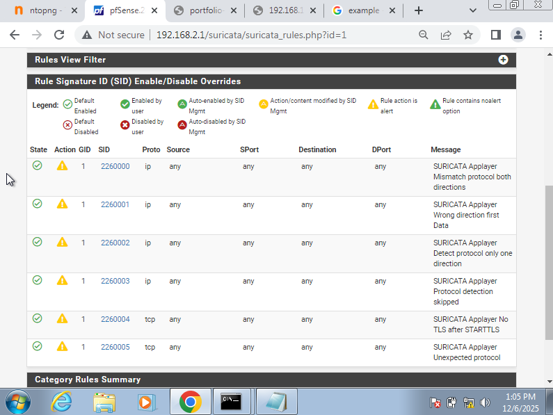
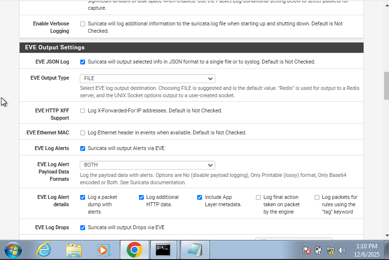
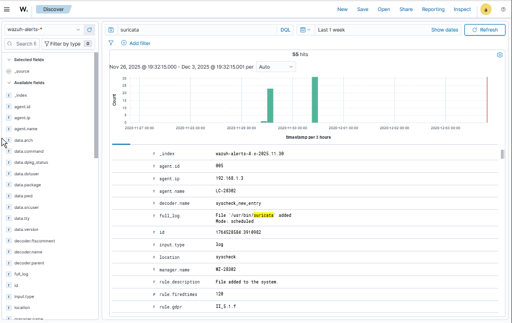

# Task 5 — IDS (Suricata) Integration

Prepared by **Paterne MURENZI (StudentID: 28302)**

---

## 1. Suricata Installation

### pfSense Installation

1. Navigate to **System → Package Manager → Available Packages**
2. Search for "Suricata" and click **Install**
3. Go to **Services → Suricata → Interfaces**
4. Add interface to monitor (WAN/LAN)

.png "Custom rules in wazuh")

---

## 2. Rule Configuration

### Enable ET Rules

1. Go to **Services → Suricata → Global Settings**
2. Enable **ETOpen Emerging Threats rules**
3. Click **Update Rules**

### Enable Categories

Navigate to **Services → Suricata → [Interface] → Categories**

Enabled categories:

- `emerging-scan` - Network scanning detection
- `emerging-exploit` - Exploitation attempts
- `emerging-malware` - Malware detection
- `emerging-dos` - DoS attacks
- `emerging-web_server` - Web application attacks



---

## 3. EVE JSON Output

### Configuration

1. Go to **Services → Suricata → [Interface] → EVE Output Settings**
2. Enable EVE JSON Log
3. Enable: Alerts, HTTP, DNS, TLS, SSH

**EVE JSON Location:**

```
/var/log/suricata/suricata_[interface]/eve.json
```


.png "Eve json")
.png "Eve json")

---

## 4. Wazuh Integration

### Configure Log Collection

Edit `/var/ossec/etc/ossec.conf` on Wazuh agent:

```xml

<localfile>
    <log_format>json</log_format>
    <location>/var/log/suricata/eve.json</location>
</localfile>
```

Restart Wazuh agent:

```bash
systemctl restart wazuh-agent
```



---

## 5. Testing & Validation

### Test 1: Network Scan Detection

From Kali machine:

```bash
nmap -sS <target-IP>
```

### Test 2: Brute Force Detection

```bash
hydra -l admin -P /usr/share/wordlists/rockyou.txt ssh://<target-IP>
```


---

## 6. Rule Tuning

### Rule 2100498 - ET SCAN Potential SSH Scan

- **Action:** Enabled
- **Justification:** Critical for detecting SSH brute force attempts against infrastructure

### Rule 2001219 - ET SCAN Nmap Scripting Engine

- **Action:** Enabled
- **Justification:** Identifies reconnaissance activity from attackers mapping the network

### Rule 2210044 - SURICATA HTTP request flood

- **Action:** Modified threshold
- **Justification:** Reduced false positives from legitimate high-traffic applications

### Rule 2013028 - ET POLICY External IP Lookup

- **Action:** Disabled
- **Justification:** Generated excessive false positives from development team's normal workflows

### Rule 2008581 - ET DROP Spamhaus DROP Listed Traffic

- **Action:** Enabled
- **Justification:** Blocks traffic from known malicious IPs, minimal false positive rate

## 7. Evidence Summary

### 7.1 EVE JSON Output

.png "Eve json")

### 7.2 Wazuh Alert Correlation


## 8. Integration Verification

- [x] Suricata installed and monitoring interface
- [x] ET rules enabled and updated
- [x] EVE JSON output configured
- [x] Wazuh receiving and parsing Suricata logs
- [x] Test scans triggering alerts
- [x] Rules tuned for environment