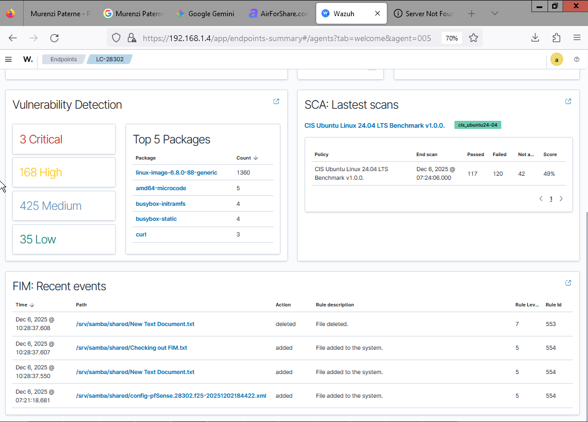
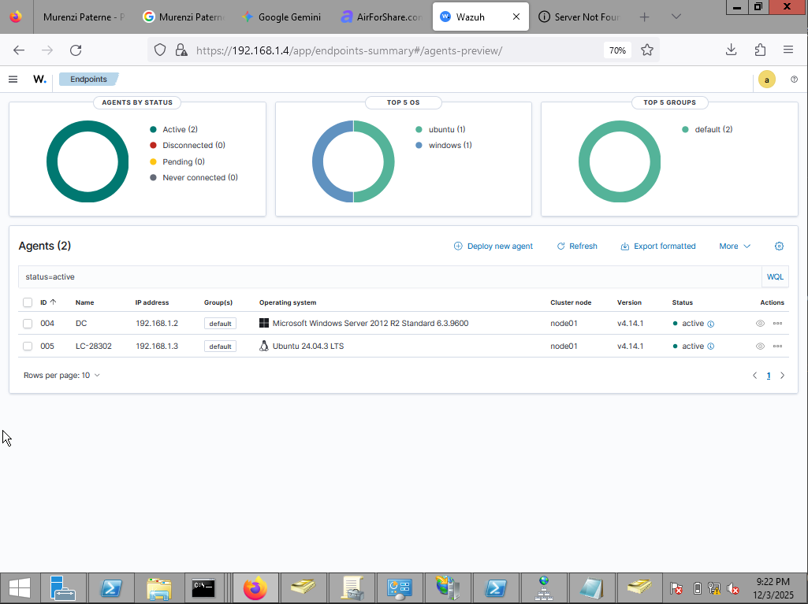
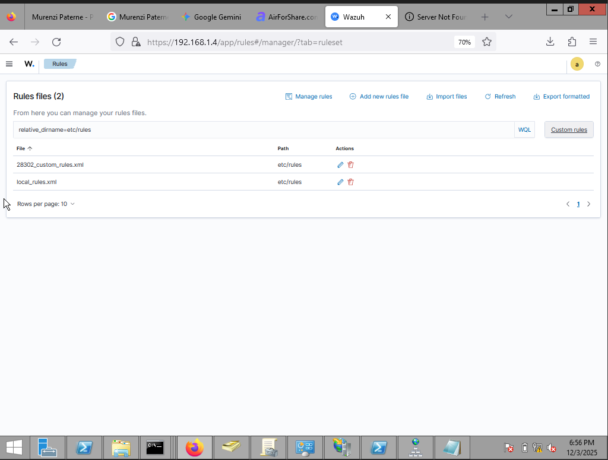

# Task 4 — Wazuh Manager & Agents Configuration

Prepared by **Paterne MURENZI (StudentID: 28302)**

---

## 1. Wazuh Manager Deployment

### Steps

#### 1.1 Deploy OVA

- Download Wazuh OVA version 4.14.0
- Import into virtualization platform (VMware/VirtualBox)
- Power on and configure network (static IP if required)

#### 1.2 Configure Hostname

```bash
hostnamectl set-hostname 28302
reboot
```

Confirm hostname:

```bash
hostnamectl
```

#### 1.3 Access Manager UI

- Open browser: `https://<Wazuh-IP>:55000`
- Create administrative user for dashboard access (if Kibana is integrated)

---

## 2. Agent Enrollment

### 2.1 Windows Agent (DC/IIS)

1. Download and install Wazuh agent on Windows Server
2. Configure `ossec.conf` with manager IP and registration key
3. Start Wazuh agent service and verify connection:

```powershell
Get-Service -Name WazuhAgent
```

### 2.2 Linux Agent (Documentation Server)

Install agent:

```bash
curl -s https://packages.wazuh.com/install.sh | sudo bash
```

Register with manager using registration key:

```bash
/var/ossec/bin/agent-auth -m <WazuhManager-IP> -p 1515
```

Start agent service and verify:

```bash
systemctl status wazuh-agent
```

### 2.3 pfSense (via Syslog Forwarding)

1. Go to **Status → System Logs → Settings**
2. Configure remote syslog to Wazuh manager IP, port 514 (UDP/TCP)
3. Verify logs appear in Wazuh manager dashboard

### 2.4 Optional: Kali Agent

Either install Wazuh agent or forward logs via syslog.

---

## 3. File Integrity Monitoring (FIM)

### Monitored Paths

#### Windows

- `C:\inetpub\wwwroot\28302_portfolio\*`
- `\\fileserver\roaming\28302\*`
- `Z:\Shared_28302\*`

#### Linux

- `/var/www/28302_docs/`
- `/etc/`
- `/usr/bin/`

### Configuration Steps

1. Edit `ossec.conf` on manager or via agent local config
2. Define `<syscheck>` paths for each monitored directory
3. Restart agent:

```bash
systemctl restart wazuh-agent
```

4. Test by modifying a file in a monitored folder and confirm alert in Wazuh dashboard

---

## 4. Log Collection

### Sources

- **Windows Event logs:** Security, System, Application
- **pfSense logs:** via syslog
- **Suricata EVE JSON logs:** from IDS integration

### Configuration Example

```xml

<localfile>
    <log_format>eventchannel</log_format>
    <location>Security</location>
</localfile>
```

Ensure manager receives events and dashboard shows them.

---

## 5. Custom Detection Rules

Create rules in `<wazuh-manager>/rules/` directory.

### Example Rules

#### Brute Force Windows

```xml

<group name="28302_BruteForce_Windows">
    <rule id="100001" level="10">
        <if_sid>4625</if_sid>
        <description>Repeated failed login attempts</description>
    </rule>
</group>
```

#### Network Scan Detection

```xml

<group name="28302_Scan_Network">
    <rule id="100002" level="8">
        <if_sid>100100</if_sid>
        <description>Suricata network scan correlated</description>
    </rule>
</group>
```

#### Unauthorized File Change

```xml

<group name="28302_Unauthorized_FileChange">
    <rule id="100003" level="12">
        <description>Changes detected in roaming/mapped shares</description>
    </rule>
</group>
```

### Apply Rules

Reload manager to apply changes:

```bash
sudo systemctl restart wazuh-manager
```

---

## 6. Evidence to Capture

- [ ] Wazuh manager dashboard showing hostname **28302**
- [ ] Agent list showing all agents online
- [ ] FIM alerts triggered by controlled file changes
- [ ] Custom detection rules firing with alert details
- [ ] Log collection from all sources verified

---

## 7. Screenshots / Images

### 7.1 Wazuh Manager Dashboard



### 7.2 Agent Status



### 7.3 File Integrity Monitoring Alerts


### 7.4 Custom Rule Detections



### 7.5 Log Collection Verification

.png "Log collection on wazuh evidence")